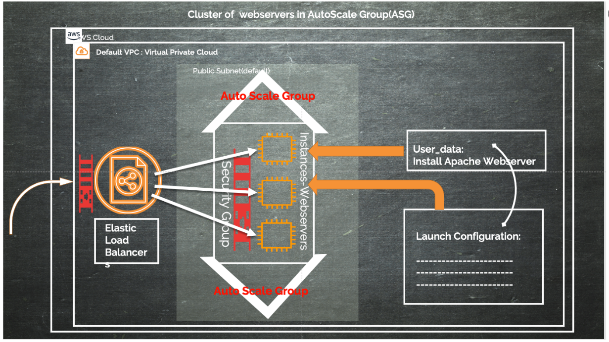

# **Terraform - Infraestructura como Codigo**

En este DEMO se planea demostrar el uso de Terraform para desplegar una infraestructura completa en la nube por medio de codigo.

## Temas a cubrir en esta Demostracion son (sin orden de importancia):

- Providers
- Definir Availabity Zone
- Region
- Definicion de Variables
- Security Groups
- Load Balancer
- Auto Scaling group
- Instances
- Post Configuration
- HTTP Server

## Arquitectura de un Cluster de Servidores Web en un Auto Scaling Group con un Elastic Load Balancers

## Sitio web oficial Documentacion Terraform
[Terraform Documentation](https://www.terraform.io/docs/index.html)

## Como Iniciar en Terraform con AWS
[Build Infrastructure with Terraform - AWS](https://learn.hashicorp.com/tutorials/terraform/aws-build)

### Se cubriran dudas despues de la presentacion de esta DEMO.

#### **by Juan Carlos Perez Hernandez**
[HashiCorp Certified: Terraform  Associate](https://www.youracclaim.com/badges/b2027591-4319-4a51-ad77-b1ac902ea3a2/public_url)

